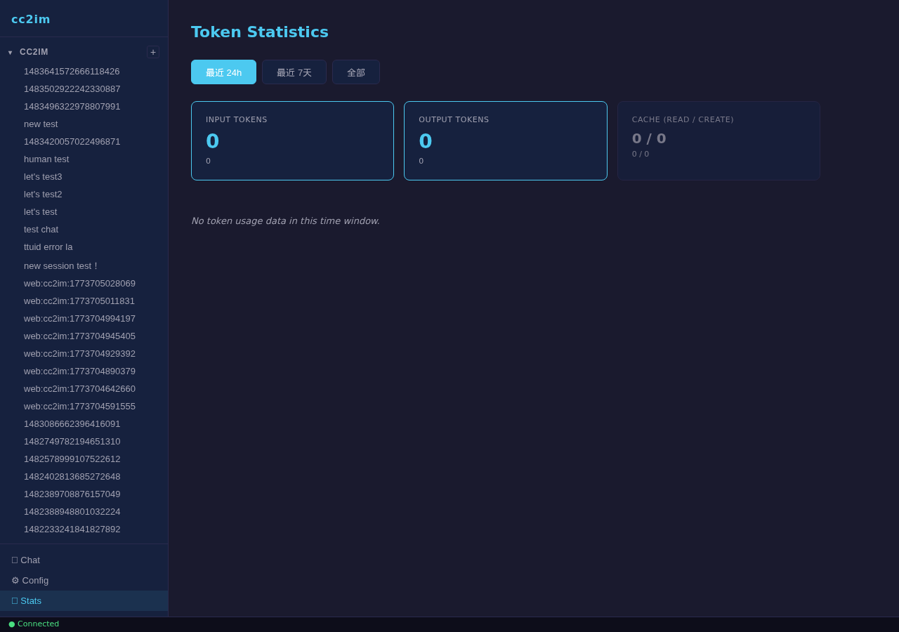
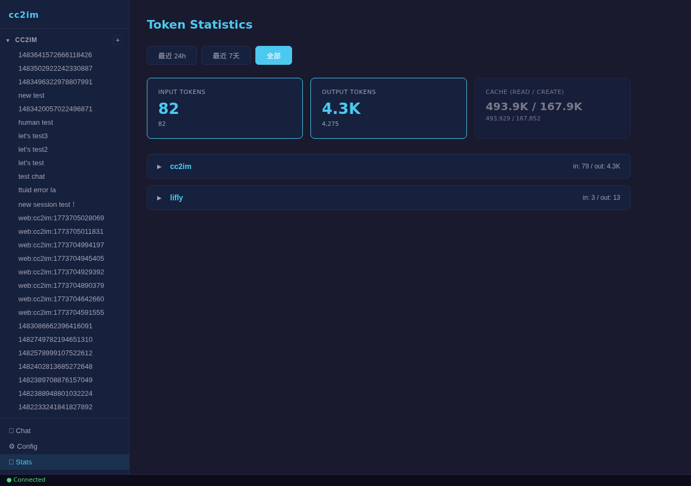
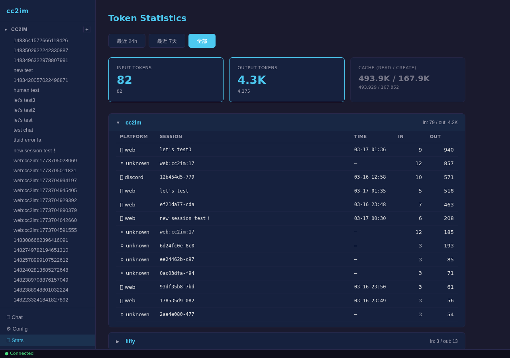

# Walkthrough: token-stats-ui-optimization

## Round 2

**Date:** 2026-03-18
**Verified by:** hills-test-verify
**Environment:** cc2im local server (degraded mode -- no Docker)
**Base URL:** http://127.0.0.1:3000

> Warning: Running in degraded mode (no Docker environment). Using live service data instead of constructed seed data.

### Walkthrough Path

1. Navigate to Stats page via sidebar nav button
2. Verify 3 tab buttons with correct labels, "最近 24h" active by default
3. Verify 3 summary cards (2 primary, 1 secondary) with correct layout
4. Compare 24h UI values against `/api/stats/overview?window=24h` API response
5. Switch to "全部" tab, verify active state
6. Compare "全部" UI values against `/api/stats/overview?window=all` API response
7. Expand first project card ("cc2im"), verify session table with 5 columns
8. Verify session data accuracy: platform icons, session names, token values against API
9. Collapse and re-expand project card, verify toggle behavior
10. Refresh page, navigate back to Stats, switch to "全部", verify values persist

### Results

| Step | Action | Screenshot | Existence | Content | Accuracy | Persistence | Responsiveness | Flow | Verdict |
|------|--------|------------|-----------|---------|----------|-------------|----------------|------|---------|
| 1 | Navigate to Stats page |  | PASS - Stats page element rendered | PASS - "Token Statistics" heading visible | N/A | N/A | PASS - page loaded within 500ms | PASS - sidebar nav click triggered page change | PASS |
| 2 | Verify tabs (24h default) |  | PASS - 3 tab buttons found | PASS - labels: "最近 24h", "最近 7天", "全部" | PASS - labels match WINDOWS config | N/A | N/A | PASS - first tab has `.active` class | PASS |
| 3 | Verify summary cards |  | PASS - 2 primary, 1 secondary card | PASS - labels: Input Tokens, Output Tokens, Cache (read / create) | N/A | N/A | N/A | PASS - cards render after data loads | PASS |
| 4 | Data accuracy (24h) | N/A (data comparison) | N/A | N/A | PASS - Input: UI "0" = API "0"; Output: UI "0" = API "0"; Cache: UI "0 / 0" = API "0 / 0" | N/A | N/A | N/A | PASS |
| 5 | Switch to "全部" tab |  | PASS - tab exists | PASS - "全部" button highlighted | PASS - tab has `.active` class | N/A | PASS - data loaded after tab click | PASS - smooth transition | PASS |
| 6 | Data accuracy ("全部") | N/A (data comparison) | N/A | N/A | PASS - Input: UI "82" = API "82"; Output: UI "4.3K" = API "4.3K"; Cache: UI "493.9K / 167.9K" = API "493.9K / 167.9K"; Sub-values: "82", "4,275" match | N/A | N/A | N/A | PASS |
| 7 | Expand project card |  | PASS - session table rendered | PASS - 5 columns: Platform, Session, Time, In, Out; 13 session rows | PASS - columns match spec exactly | N/A | PASS - table appeared after click | PASS - collapse icon changed from ">" to "v" | PASS |
| 8 | Session data accuracy | N/A (data comparison) | N/A | N/A | PASS - All 13 sessions verified: platform icons (web/discord/unknown), session names, In/Out token values all match API response | N/A | N/A | N/A | PASS |
| 9 | Collapse and re-expand |  | PASS - table present after re-expand | PASS - table hidden on collapse, visible on re-expand | N/A | PASS - toggle state works consistently | PASS - immediate response to clicks | PASS - bidirectional toggle works | PASS |
| 10 | Refresh persistence |  | PASS - Stats page restored | PASS - card values displayed | PASS - Input "82" and Output "4.3K" match pre-refresh values | PASS - data consistent across page reload | PASS - page reload + nav completed smoothly | PASS - full flow: reload -> nav -> tab switch | PASS |

### Issues Found

No issues found. All 10 walkthrough steps passed successfully.

### 6-Dimension Summary

| Dimension | Assessment | Details |
|-----------|------------|---------|
| **Existence** | PASS | All UI elements (tabs, cards, project cards, session tables) render correctly |
| **Content** | PASS | Labels, headings, column names, and tab text all display correctly with expected values |
| **Accuracy** | PASS | All UI values (24h and "全部" windows) match corresponding API responses exactly. All 13 sessions verified for platform, name, and token counts |
| **Persistence** | PASS | Data values remain consistent after page reload and re-navigation. Toggle state (collapse/expand) works correctly |
| **Responsiveness** | PASS | Tab switching, project expand/collapse, and page navigation all respond promptly |
| **Flow continuity** | PASS | Full user flow (navigate -> view tabs -> switch window -> expand project -> collapse/re-expand -> refresh) works without interruption |

### Overall Verdict

**Result: PASS**

All 10 walkthrough steps passed. The Stats page UI correctly displays token statistics with:
- 3 time window tabs with proper default selection
- 3 summary cards (2 primary + 1 secondary) showing accurate token counts
- Hierarchical project/session view with expandable project cards
- Session table with correct columns (Platform, Session, Time, In, Out)
- Accurate data matching API responses for both 24h and "全部" windows
- Platform icons correctly rendered (web, discord, unknown)
- Persistence across page refresh
- Smooth collapse/expand toggle behavior

Note: 24h window showed zero values (no recent token usage), which is consistent with the API response. "全部" window showed 2 projects (cc2im with 13 sessions, lifly with 1 session) with all values matching the API.
