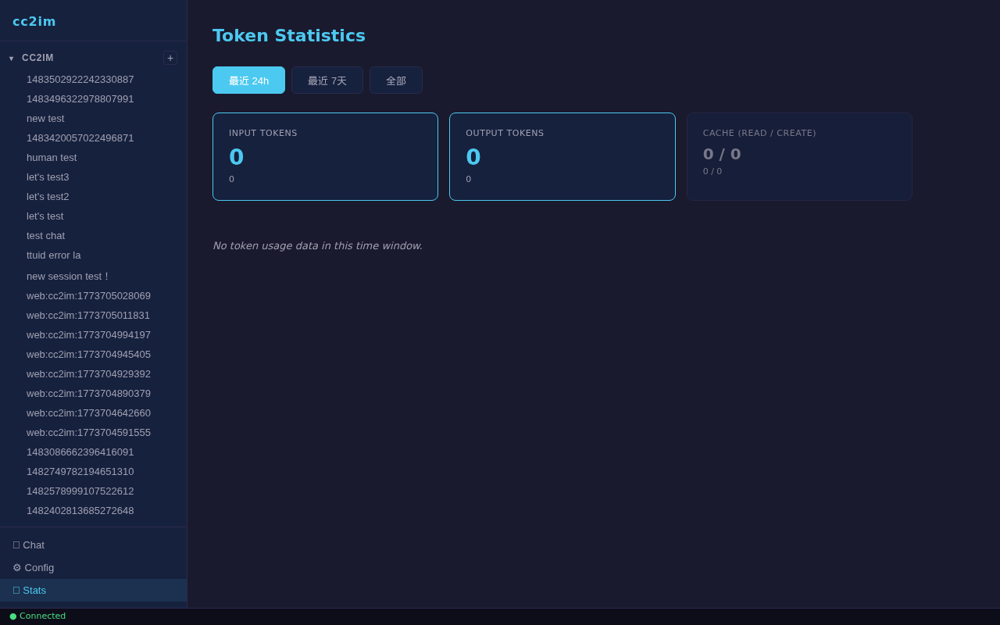
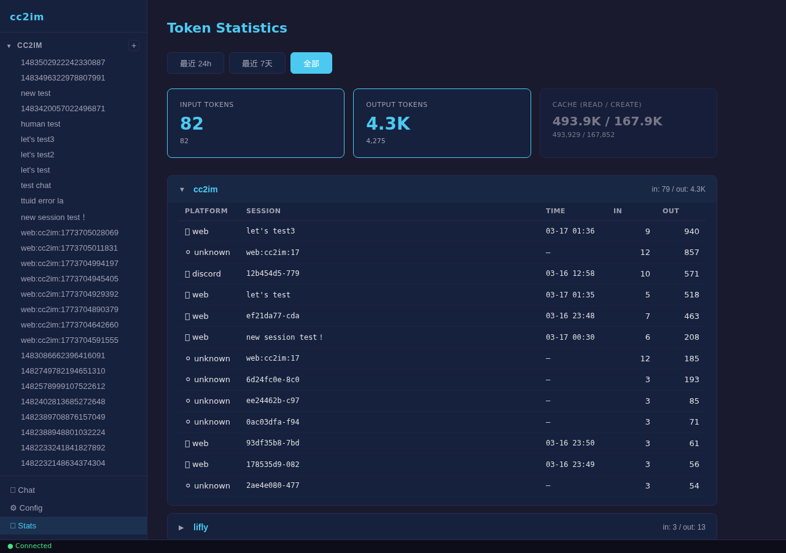
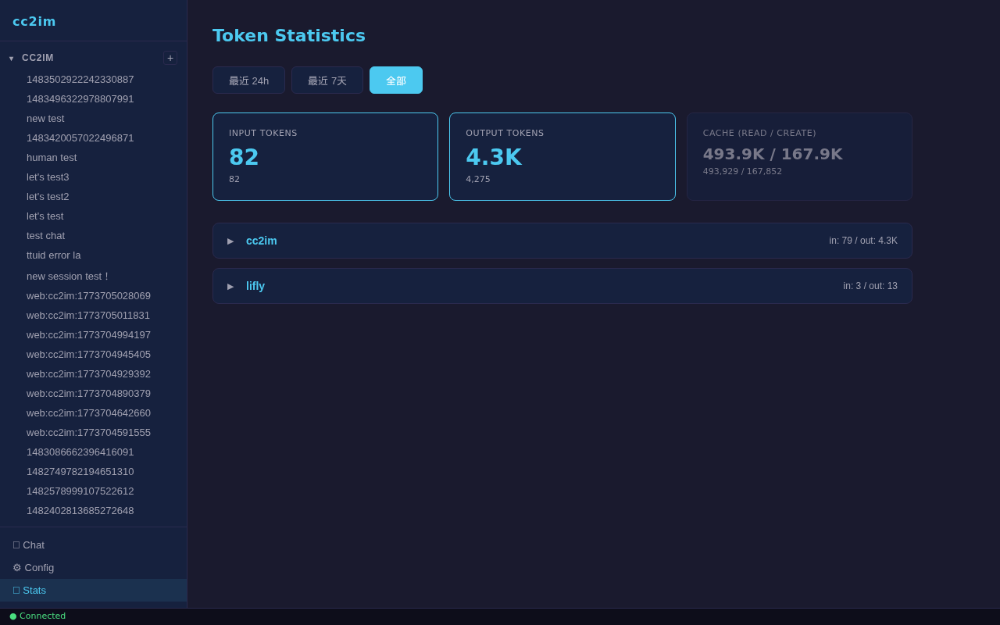

# Walkthrough: token-stats-ui-optimization

## Round 1

**Date:** 2026-03-18
**Verified by:** hills-test-verify
**Environment:** cc2im local server (npm installed build)
**Base URL:** http://127.0.0.1:3000

### Walkthrough Path
Stats page visual verification: navigation, tabs, cards, data accuracy, project accordion, persistence

### Results

| Step | Action | Screenshot | Existence | Content | Accuracy | Persistence | Responsiveness | Flow | Verdict |
|------|--------|------------|-----------|---------|----------|-------------|----------------|------|---------|
| 1 | Navigate to Stats page via sidebar nav button |  | PASS - "Token Statistics" header visible | PASS - Header text correct | N/A | N/A | PASS - Page loads within 1.5s | PASS - Sidebar nav click works | PASS |
| 2 | Verify time window tabs (3 tabs, first active) |  | PASS - 3 tab buttons visible | PASS - Labels match exactly: "最近 24h", "最近 7天", "全部" | N/A | N/A | N/A | PASS - First tab ("最近 24h") has `.active` class by default | PASS |
| 3 | Verify summary cards (2 primary, 1 secondary) |  | PASS - 3 cards visible | PASS - Labels: "Input Tokens", "Output Tokens", "Cache (read / create)"; values show 0 for 24h window (no recent data) | N/A | N/A | N/A | N/A | PASS |
| 4 | Compare UI card values vs API `/api/stats/overview?window=24h` | N/A (data comparison) | N/A | N/A | PASS - UI Input=0 matches API input=0; UI Output=0 matches API output=0 | N/A | N/A | N/A | PASS |
| 5 | Switch to "全部" tab |  | PASS - Tab, cards, and 2 project cards visible | PASS - Input=82, Output=4.3K (sub: 4,275), Cache=493.9K/167.9K (sub: 493,929/167,852) | PASS - Values match API `window=all` response | N/A | PASS - Data updates promptly after tab click | PASS - Tab switching triggers re-fetch and re-render | PASS |
| 6 | Expand "cc2im" project card |  | PASS - Session table appears with 13 rows | PASS - Columns: Platform, Session, Time, In, Out; rows show platform icons, session names/IDs, timestamps, token counts | PASS - Session data (e.g., "let's test3" in=9, out=940) matches API response | N/A | PASS - Table renders within 1s of click | PASS - Collapse icon changes from right-arrow to down-arrow; table appears inside card | PASS |
| 7 | Refresh page, navigate back to Stats, verify persistence |  | PASS - Stats page re-renders correctly after refresh | PASS - Tab resets to "最近 24h" (expected); after switching to "全部", values identical: Input=82, Output=4,275 | PASS - Data persists across page refresh (server-side persistence confirmed) | PASS - Values before refresh match values after refresh | PASS - Page reload and re-navigation complete smoothly | PASS - Full cycle: refresh -> nav -> tab switch works | PASS |

### Issues Found

No blocking issues found. All 7 walkthrough steps passed.

**Minor observations (non-blocking):**
1. **24h window shows zero data**: The 24h time window returns all-zero values and "No token usage data in this time window." This is expected behavior -- all stored sessions are older than 24 hours.
2. **Tab state not preserved on refresh**: After page reload, the active tab resets to "最近 24h" instead of preserving the previously selected tab. This is documented as expected behavior (no URL parameter or localStorage persistence for tab state).

### 6-Dimension Summary

| Dimension | Overall | Notes |
|-----------|---------|-------|
| Existence | PASS | All elements (header, tabs, cards, project cards, session tables) render correctly |
| Content | PASS | Labels, formatted values (fmt/fmtFull), column headers, platform icons all correct |
| Accuracy | PASS | UI card-sub values exactly match API response for both 24h (0/0) and all (82/4,275) |
| Persistence | PASS | Data survives full page refresh; values identical before and after reload |
| Responsiveness | PASS | Tab switches and project expand/collapse respond within 1-1.5 seconds |
| Flow continuity | PASS | Multi-step flows (nav -> tab -> expand -> refresh -> nav -> tab) complete without errors |

### Overall Verdict
**Result: PASS**

All 7 walkthrough steps verified successfully. The Stats page UI correctly implements time window tabs, summary cards with formatted values, collapsible project cards with session tables, and data accuracy against the API. The page survives refresh with consistent data.
